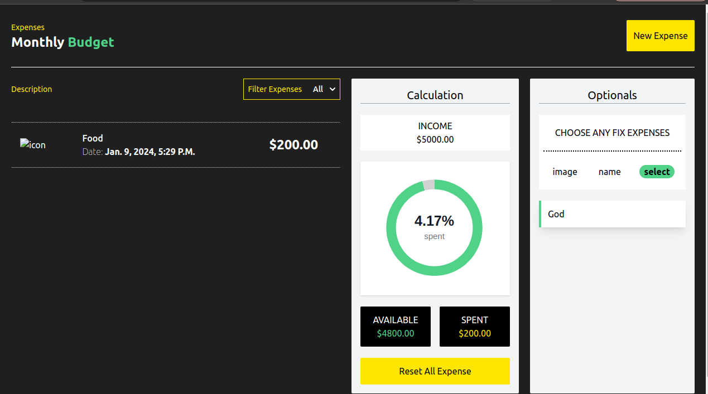
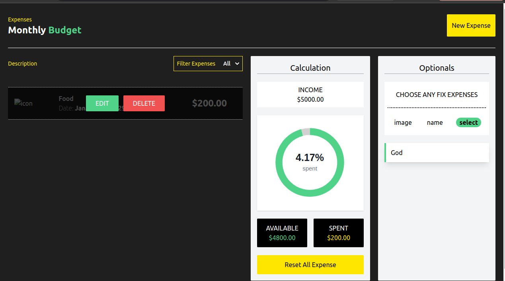

# miniUrl - URL Shortening Web App

miniUrl is a simple and user-friendly URL shortening web application. It allows users to generate short URLs for long links, making them easier to share and manage. This README provides information on how to set up and use miniUrl.

## Table of Contents
- [Features](#features)
- [Screenshots](#screenshots)
- [Getting Started](#getting-started)
- [Usage](#usage)
- [Contributing](#contributing)
- [License](#license)

## Features

- Track income, expenses, and savings for each month.
- Categorize expenses to better understand spending patterns.
- Monthly and yearly overviews for budget analysis.
- Simple and intuitive user interface.

## Screenshots


*Caption: Landing Page - Users can navigate to income, expenses, and savings sections.*


*Caption: Monthly Overview - A snapshot of income, expenses, and savings for the selected month.*


*Caption: Category Analysis - Visual representation of expenses by category for better insights.*


## Getting Started

To set up BudgetTracker on your local machine, follow these steps:

1. Clone the repository:

    ```bash
    git clone https://github.com/your-username/miniUrl.git
    cd monthly_budget
    ```

2. Create a virtual environment and activate it:

    ```bash
    python -m venv venv
    source venv/bin/activate   # On Windows: .\venv\Scripts\activate
    ```

3. Install dependencies:

    ```bash
    pip install -r requirements.txt
    ```

4. Apply database migrations:

    ```bash
    python manage.py migrate
    ```

5. Run the development server:

    ```bash
    python manage.py runserver
    ```

6. Open your browser and go to [http://localhost:8000](http://localhost:8000).

## Usage

1. Visit the miniUrl website.
2. Enter a long URL in the provided input field.
3. Click the "Shorten" button to generate a short URL.
4. Optionally, register an account to customize short URLs and access link analytics.

## Contributing

We welcome contributions! If you have suggestions or find issues, please create a GitHub issue or submit a pull request.
